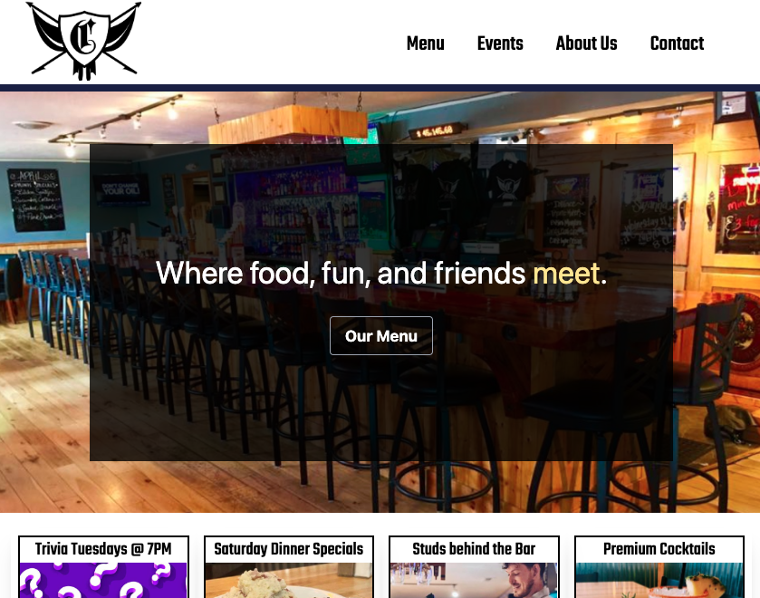

# Chase Bar & Grill Site

### Written in ReactJS & Tailwind

## Instructions

1. Download this repo to your computer.
2. Install npm packages by typing 'npm install' in terminal inside the root of the downloaded repo.
3. Type 'npm start' to run a local instance of this with ReactJS.
4. Visit localhost:3000 to see it live.

### Future Goals / Plans

- Add backend for client to be able to update 'AboutPanel' subcomponent (tiles)
- Build out pages

#### by probablynotryan
